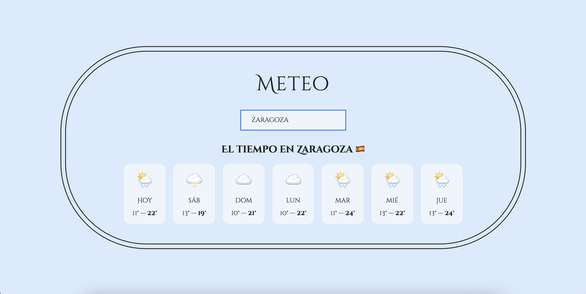

# 🌦️ Meteo

**Meteo** es una aplicación del tiempo simple y elegante construida con **React**. Permite a los usuarios buscar cualquier ciudad del mundo y obtener instantáneamente las condiciones meteorológicas actuales. El proyecto utiliza la **API de Geocodificación de Open-Meteo** para resolver nombres de ciudades y obtener los datos del clima.

> ⚠️ Esta app es una página estática y **no es responsiva**.
---

## 🚀 Características

- 🔍 Busca cualquier ciudad _(introducida en inglés)_ y obtén datos meteorológicos al instante
- 🌐 Impulsado por [Open-Meteo Geocoding API](https://open-meteo.com/)
- ⚡ Rápido y liviano
- 🎯 Construido con **Create React App**
- 📄 Diseño simple para acceso y pruebas rápidas

[El tiempo en tu ciudad](https://albahdezs.github.io/meteo/)

---

## 🎆 Imágenes

<br />



--

## 🛠 Tecnologías

- **React** (con Create React App)
- **Open-Meteo API**
- **HTML / CSS / JavaScript**
- **GitHub Pages** para despliegue

---

## 🔧 Instalación

1. Clona el repositorio:

```bash
git clone https://github.com/Albahdezs/meteo.git
cd meteo
```

2. Instala dependencias:

```bash
npm install
```

3. Inicia el servidor de desarrollo:

```bash
npm start
```

4. Compila para producción:

```bash
npm run build
```

---

## 📬 Contacto

Created by [@Albahdezs](https://github.com/Albahdezs) – ¡no dudes en contactarme!

Si tienes sugerencias o comentarios, puedes abrir un issue o escribirme a través de GitHub.
Email: alba.hdez.serr@gmail.com


